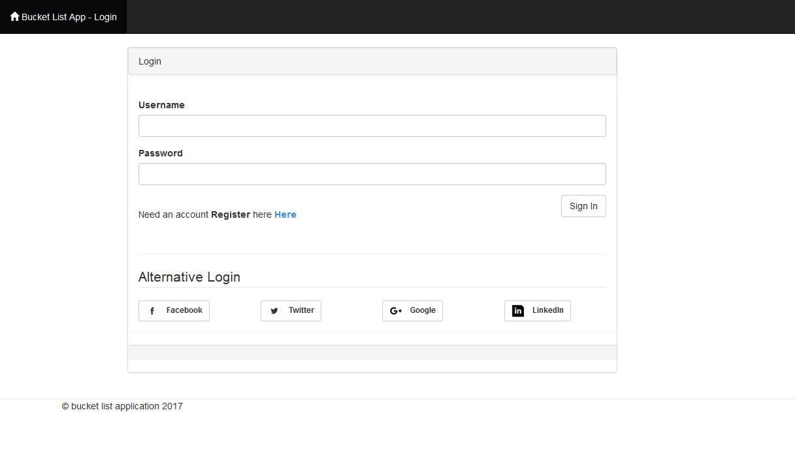
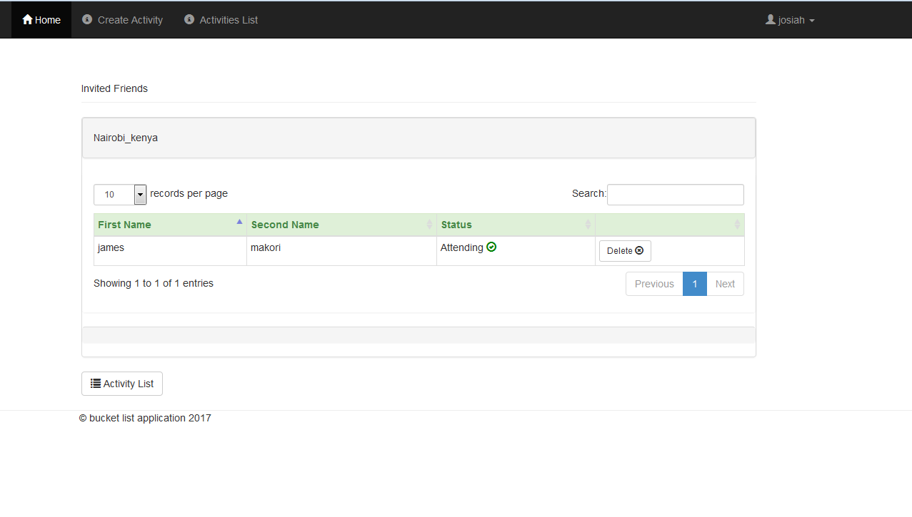
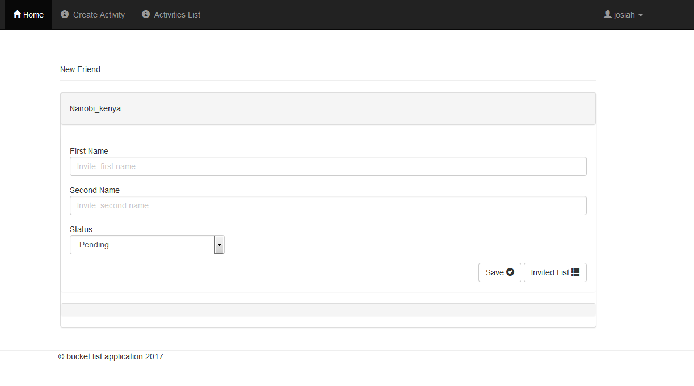
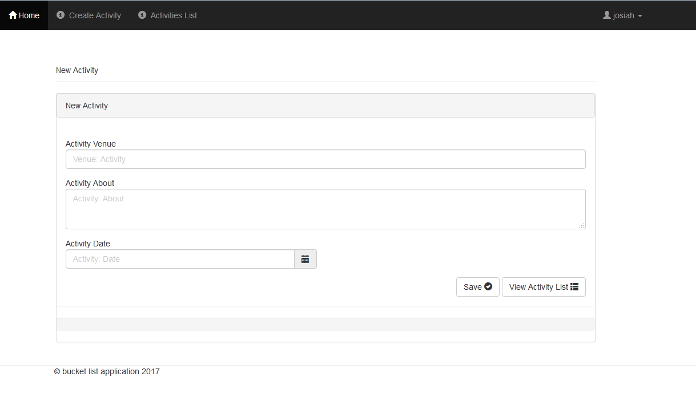
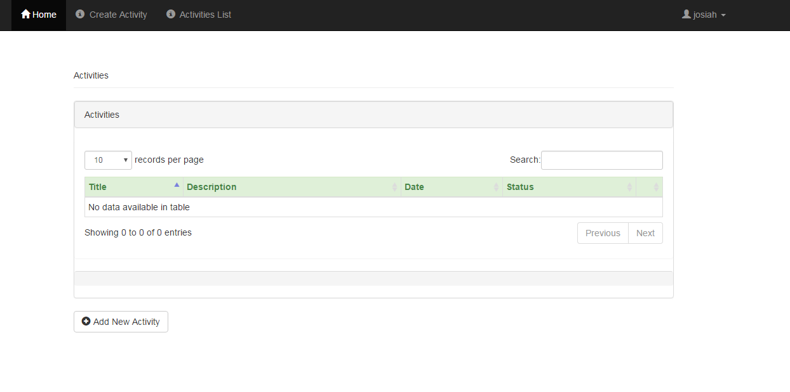

Buckect-list
=============

Buckect-list is a Flask extension that automatically creates documentation for your endpoints based on the routes, function arguments and docstrings.

# Buckect List

A bucket list application that helps us record  activities we wish to undertake, tick off what we have done and even invite our  friends to have fun with us

## Install

To install Buckect-list, run pip:

	pip install Buckect-list
	
or clone this directory and run setup:

    python setup.py install

## Custom documentation

To access the documentation without rendering html:

    @app.route('/documentation')
    def documentation():
        return auto.generate()

the documentation will be returned as a list of rules, where each rule is a dictionary containing:

- methods: the set of allowed methods (ie ['GET', 'POST'])
- rule: relative url (ie '/user/<int:id>')
- endpoint: function name (ie 'show_user')
- doc: docstring of the function
- args: function arguments
- defaults: defaults values for the arguments

## Custom template

To use a custom template for your documentation, give a _template_ argument to the _html_ method. This will use a template from the flask _templates_ directory. 

Additional arguments (other than _group_, _groups_, and _template_) will be passed down to the template:

	auto.html(
		
		template='custom_documentation.html'
		
		title='My Documentation',
		author='John Doe',
	)
	

_title_ and _author_ will be available in the template:

	<!-- templates/custom_documentation.html -->
	...
	
		{{title}}
	
	...

## Documentation sets

Endpoints can be grouped together in different documentation sets. It is possible for instance to show some endpoints to third party developers and have full documentation for primary developers.

To assign an endpoint to a group, pass the name of the group as argument of the _doc_ decorator:

    @app.route('/user/<int:id>')
    @auto.doc('public')
    def show_user(id):

to assign an endpoint to multiple groups, pass a list of group names as the _groups_ argument to _doc_:

    @app.route('/user/<int:id>')
    @auto.doc(groups=['public','private'])
    def show_user(id):

to generate the documentation for a specific group, pass the name of the group to the _html_ or _generate_ methods:

    auto.html('public')
    auto.html(groups=['public','private'])
    auto.generate('public')

## Authors

* **Josiah M. Nyarega** - *Initial work* - [jmnyarerga](https://github.com/jmnyarerga)

See also the list of [contributors](https://github.com/your/project/contributors) who participated in this project.

## Examples

Apps in the _examples_ directory are an api for a blog:

- _simple_ is a simple app
- _factory_ uses blueprints

Run with

	python activities/app.py
	
and connect to [/access app](http://127.0.0.1:5000/) to see public and private documentations.

## Built With

* [Flask](http://flask.pocoo.org/docs/0.12/) - The web framework used
* [SqlAlchemy](http://docs.sqlalchemy.org/en/latest/) - Dependency Management

## Screenshots

## Acknowledgments

* Inspiration from Andela

