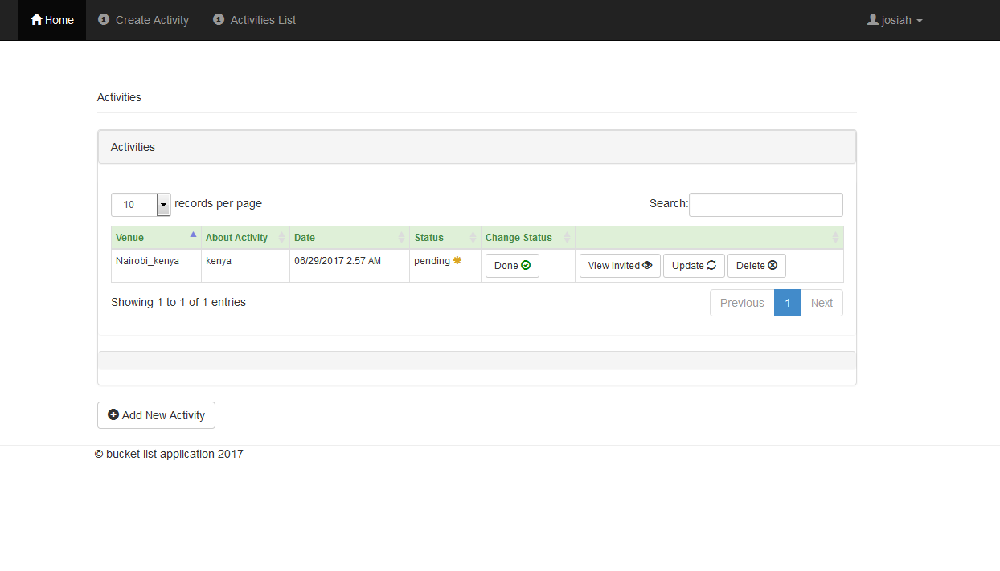

Buckect List Application
=============

A bucket list application that helps us record  activities we wish to undertake, tick off what we have done and even invite our  friends to have fun with us

# Mockup Screenshots
## Registration

## Login

## View Activities

## New Activity

## View Invited

## Add friends

## Install

To install Buckect-list, run pip:

    python setup.py install

## Examples

Apps in the _examples_ directory are an api for a blog:

- _activities_ is a simple app

Run with

	python activities/app.py
	
and connect to [/access app](http://127.0.0.1:5000/) to see public and private documentations.

## Built With

* [Flask](http://flask.pocoo.org/docs/0.12/) - The web framework used
<!--* [SqlAlchemy](http://docs.sqlalchemy.org/en/latest/) - Dependency Management-->

# Application Screenshots

## Login

## Registration

## Invited List

## Add Friend to Activity

## Add New Activity

## Activity List

## Feedback 

* *If you have any any problems setting up the application , u can always reach me via the issues section :)*

## Authors

* **Josiah M. Nyarega** - *Initial work* - [jmnyarerga](https://github.com/jmnyarerga)

See also the list of [contributors](https://github.com/jmnyarerga/buckect_list/contributors) who participated in this project.

## Acknowledgments

* Inspiration from Andela

